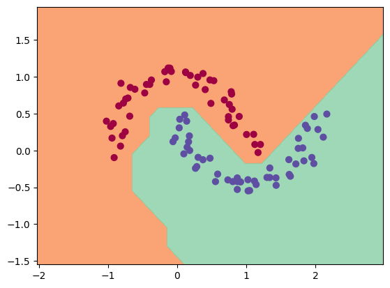

# Minigrad
Minigrad is a mini autograd framework inspired by Andrej Karpathy's [micrograd](https://github.com/karpathy/micrograd).


The Minigrad package consists of an `engine.py` file which defines the class `Value` which is the basic building block for the framework. In `nn.py` exists additional classes that build on top of the engine including `Neurons`, `Layers`, and `MLP`, used to build out simple MLP networks.

The `.github/workflows/test.yml` runs an automated check of the tests located at `test/operations.py` on a push or pull request to ensure the functionality of minigrad is as expected before a merge.


## Example usage


Below is a slightly contrived example showing a number of possible supported operations:


```python
from minigrad.engine import Value


a = Value(2.0)
b = Value(-1.5)
c = b ** 2
d = a * c + b
e = d ** -1
f = e.relu() / 3.0
print(f"f.data: {f.data:.4f}") # 0.1111 Output of the chain of operations
f.backward() # Backward pass through the chain of operations
print(f"a.grad: {a.grad:.4f}") # -0.0833, df/da
print(f"b.grad: {b.grad:.4f}") # 0.1852, df/db
```


## Training a MLP
Under Example 2, in `examples.ipynb`, you will see a small MLP trained for a binary classification problem. Below is an example of the trained decision boundary for the data trained on.



## Future Work
- Create additional layers (Conv, BatchNorm, etc.)
- Build out model examples in minigrad (ResNet, Transformer)
- Register minigrad as package under pypi
